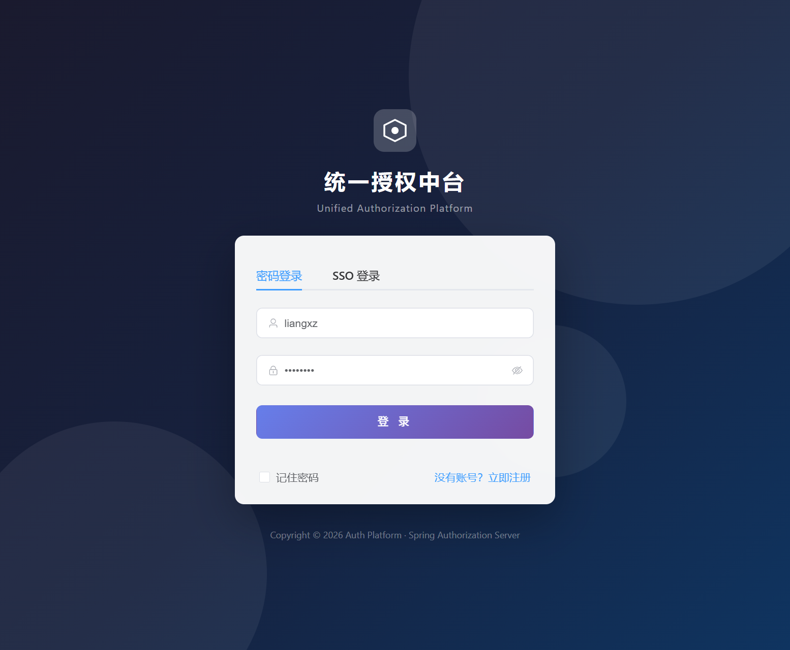
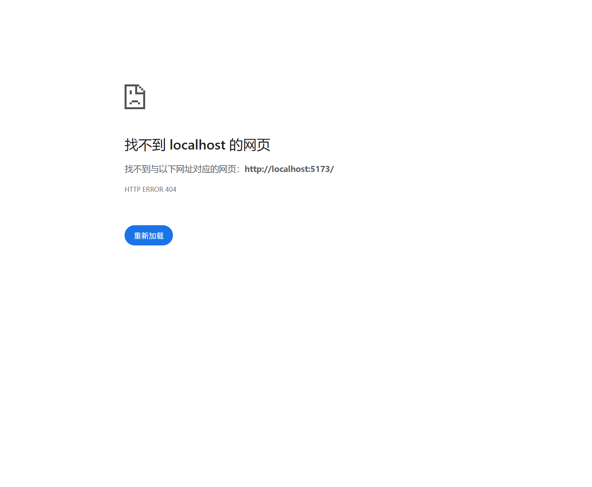
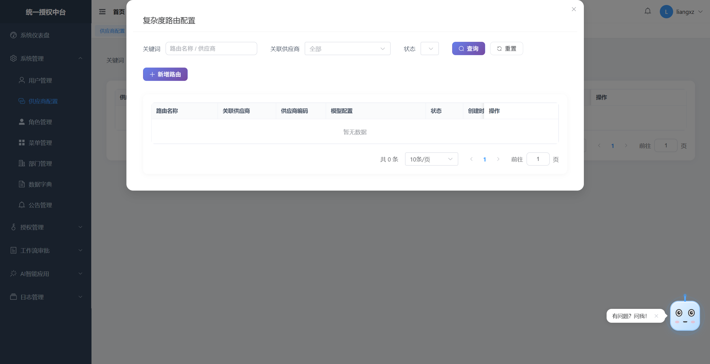
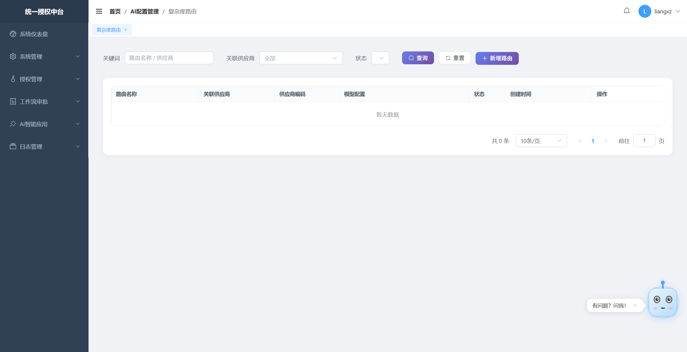

# auth-platform

> 自研统一授权中台：基于 **Spring Authorization Server** 的 OAuth2 认证授权平台，叠加**自定义工作流审批**、**分布式消息广播**、**AI 智能体（RAG）** 与**统一日志分析**，并提供 Web / 移动端管理界面与子系统接入 SDK。

<!-- 徽章（可选，发布前替换为真实地址）


-->

---

## 📖 项目简介

`auth-platform` 是一套面向多端、多业务子系统的**统一身份与权限中台**。它将认证授权、权限管控、审批流转、消息触达、AI 辅助决策与日志审计收敛到一个平台，对外提供统一的网关入口与标准 OAuth2 协议接口，对内以微服务方式解耦各个能力域。

核心解决痛点：

- 多套业务系统各自实现登录 / 鉴权，标准不一、维护成本高
- 权限模型分散，缺少统一的 RBAC 与细粒度方法级控制
- 权限开通依赖人工，缺少可编排的审批工作流
- 子系统之间缺乏统一的消息与事件广播通道
- 日志分散、难以统一检索与智能分析

---

## ✨ 核心特性

- **统一 OAuth2 授权**：基于 Spring Authorization Server 实现令牌签发、刷新、吊销，支持 JWT + JWKS 本地验签。
- **细粒度 RBAC**：用户 / 角色 / 菜单 / 部门 / 客户端 / 字典管理，方法级 `@RequirePermission` 注解鉴权，前端 `v-permission` 仅做 UX 级隐藏。
- **自定义工作流审批**：授权申请、流转节点、权限开通 / 驳回，审批结果与权限自动联动。
- **消息广播服务**：站内信 / 邮件 / 短信 / WebSocket 多通道，基于 MQ 的子系统上下行广播。
- **AI 智能体（RAG）**：LangChain4j 知识库检索、联网搜索、业务数据预警智能体。
- **统一日志分析**：日志采集、查询与 AI 日志分析。
- **微服务治理**：Nacos 注册 / 配置中心、Spring Cloud Gateway 统一路由与限流、Sentinel 熔断降级。

---

## 🏗 系统架构


```
┌─────────────────────────────────────────────────────────────
客户端层：App、Web 前端、各业务子系统、第三方接入应用
├─────────────────────────────────────────────────────────────
接入网关层：Spring Cloud Gateway
路由转发、鉴权拦截、Token 校验、流量限流、请求溯源
├─────────────────────────────────────────────────────────────
中台核心服务（微服务拆分）
1. 统一授权服务（OAuth2 令牌发放、刷新、吊销）
2. 自定义工作流审批服务（授权申请、权限开通驳回、流转节点）
3. 消息广播服务（MQ 广播、子系统上下行通信、事件推送）
4. AI 智能应用服务（RAG 知识库、本地离线检索、联网搜索、业务数据分析预警）
5. 系统管理服务（RBAC、审计、字典）
6. 统一日志服务（日志采集、查询、AI 分析）
├─────────────────────────────────────────────────────────────
基础设施层
MySQL、Redis、RocketMQ/Kafka、MinIO、向量库(FAISS/Milvus)、Nacos、Sentinel
└─────────────────────────────────────────────────────────────
```

**单条请求路径**：

```
Client
  → Spring Cloud Gateway :8080（AuthGlobalFilter 用 JWKS 本地验签）
    → 按路径前缀路由到 lb://<service>
      → 业务服务经 resource-server-starter 做方法级权限校验（或 @PublicApi 放行）
```

跨服务通信走 HTTP（经网关）或 MQ（auth-message 广播），**非** Maven 模块间直接依赖。

---

## 🧩 技术栈

| 分类 | 技术 |
| --- | --- |
| 后端框架 | Spring Boot 3.2.5、Spring Cloud 2023.0.1、Spring Cloud Alibaba 2023.0.1.2 |
| 认证授权 | Spring Authorization Server 1.2.4、JWT / JWKS |
| 注册 / 配置中心 | Nacos 2.3.2 |
| 服务网关 | Spring Cloud Gateway |
| 熔断限流 | Sentinel |
| 持久层 | MyBatis（system-server）、Spring JDBC / JdbcTemplate（其余模块） |
| 关系数据库 | MySQL 8.x |
| 缓存 | Redis |
| 消息队列 | RabbitMQ / RocketMQ |
| 对象存储 | MinIO |
| 向量库 | FAISS / Milvus（AI 检索） |
| AI | LangChain4j |
| 文档聚合 | Knife4j 4.5.0 |
| 前端（Web） | Vue3 + Vite + TypeScript |
| 前端（移动端） | UniApp |
| 构建工具 | Maven（后端）、Node.js + Vite（前端） |
| JDK | Java 17 |

---

## 📦 模块说明

| 模块 | 端口 | 职责 | 包名前缀 |
| --- | --- | --- | --- |
| `gateway` | 8080 | 路由 / 鉴权 / 限流入口 | `com.liang.xz.gateway` |
| `auth-server` | 9000 | OAuth2 认证授权核心 | `com.liang.xz.server` |
| `system-server` | 9001 | RBAC 与系统管理 | `com.liang.xz.system` |
| `auth-flow` | 9011 | 工作流审批 | `com.liang.xz.flow` |
| `auth-message` | 9002 | 消息广播 | `com.liang.xz.message` |
| `ai-agent-server` | 9003 | AI 智能体 / RAG | `com.liang.xz.aiagent` |
| `log-server` | 9009 | 日志收集与分析 | `com.liang.xz.log` |
| `knife4j-aggregation` | 10909 | API 文档聚合 | — |
| `common-core` | — | 公共底座（实体 / 常量 / 工具 / 统一返回 / 上下文 / Redis / Nacos / 动态数据源 / Trace） | `com.liang.xz.common.core` |
| `resource-server-starter` | — | 资源服务器自动配置（JWT 验签、`@RequirePermission`、`@PublicApi`） | — |
| `subsystem-sdk` | — | 外部子系统接入 SDK（监听广播、上报消息） | — |

**网关路由前缀** → 目标服务：

| 前缀 | 服务 |
| --- | --- |
| `/auth-server/**` | auth-server |
| `/system-server/**` | system-server |
| `/auth-flow/**` | auth-flow |
| `/auth-message/**` | auth-message |
| `/ai-agent-server/**` | ai-agent-server |
| `/log-server/**` | log-server |

---

## 🚀 环境要求

- JDK 17
- Maven 3.8+
- Node.js 18+（前端 Web / 移动端）
- MySQL 8.x
- Redis
- Nacos 2.3.2（注册中心 + 配置中心，默认 `127.0.0.1:8848`）
- RabbitMQ 或 RocketMQ（消息广播）
- MinIO（文件存储）
- 向量库（FAISS / Milvus，AI 检索，可选）

> 基础设施可借助仓库根目录的 `docker-compose.dev.yml` 一键拉起（Nacos / MySQL / Redis / MQ 等）。

---

## ⚡ 快速开始

### 1. 启动基础设施

推荐使用 `docker-compose.dev.yml` 启动依赖组件：

```bash
docker compose -f docker-compose.dev.yml up -d
```

或本地自行安装并启动 Nacos（standalone）、MySQL、Redis、MQ 等。

### 2. 初始化数据库

在 MySQL 中创建数据库后，执行 `data/` 下的初始化脚本（含建表与种子数据）：

```bash
mysql -uroot -p auth_platform < data/data-seed-all.sql
mysql -uroot -p auth_platform < data/seed-workflow.sql
mysql -uroot -p auth_platform < data/menu-rebuild.sql
```

> 数据库名请与 Nacos 中 `datasource.yml` 的配置保持一致（默认主库 `auth_platform`、从库 `auth_log`）。

### 3. 配置 Nacos

- 命名空间：`auth-platform`（分组 `AUTH_GROUP`）
- 导入各模块配置：`datasource.yml`、`redis.yml`、`auth-security.yml`、`resource-server.yml`、`common-config.yml`、`gateway.yml`、`rabbitmq.yml`、`resilience4j.yml` 及各服务 `xxx.yml`
- 敏感配置（如数据库密码）使用 `ENC{AES:...}` 加密格式，由 `common-core` 在启动时自动解密
- Nacos 默认账号 / 密码：`nacos` / `nacos`

### 4. 启动后端服务

在 IDE（如 IntelliJ IDEA）中直接运行各模块的 `*Application` 启动类，或：

```bash
# 编译全部模块
mvn -q compile

# 仅编译并启动网关（含依赖模块）
mvn -pl gateway -am spring-boot:run
```

> 本地 IDE 启动若未注入 Nacos 环境变量，将使用 `application.yml` 中的默认 `nacos` / `nacos` 凭证，需与 Nacos 服务端密码一致。

### 5. 启动前端

```bash
# Web 管理端
cd frontend-web
npm install
npm run dev          # http://localhost:5173

# 移动端（H5 模式）
cd frontend-app
npm install
npm run dev:h5      # http://localhost:5174
```

Web 端开发服务器通过 Vite proxy 将各服务前缀代理到网关（默认 `http://127.0.0.1:8080`）。

---

## 🔐 配置说明

- **配置中心**：所有环境相关配置走 Nacos；本地调试可在各模块 `application.yml` 中覆盖。
- **配置加密**：敏感项以 `ENC{AES:base64}` 形式存储，运行时由 `NacosPropertyDecryptor` / `ConfigCryptoUtil` 自动解密，密钥通过 `nacos.crypto.secret-key` 配置。
- **多数据源**：`system-server` 使用 MyBatis；其余模块多用 Spring JDBC。主从数据源通过 `common-core` 动态数据源路由。
- **统一返回**：`common-core` 提供 `R<T>`，`system-server` 另提供 `ApiResponse<T>`，前端响应拦截器两者均兼容。

---

## 📚 API 文档

各服务基于 Knife4j 生成接口文档，并通过 `knife4j-aggregation`（端口 `10909`）统一聚合：

```
http://localhost:10909/doc.html
```

---

## 🖥 功能截图

> 以下截图来自 `frontend-web/`，可直接显示在 GitHub 中；如需替换为线上地址，将路径改为图片 URL 即可。

| 页面 | 截图 |
| --- | --- |
| 登录页 |  |
| 主界面 |  |
| 路由配置对话框 |  |
| AI 配置提供方 |  |

---

## 🧭 开发规范

- 后端严格遵循 **Google Java Style Guide**（详见 `.codebuddy/rules/java-coding-style.mdc`），4 空格缩进、UTF-8、Lombok `@Data @Builder` + `@Schema` 实体、`Service` 接口与 `XxxServiceImpl` 实现分离。
- 统一返回 `R<T>` / `ApiResponse<T>`，异常集中处理。
- 面向接口编程，Controller 注入接口；MyBatis 使用 Mapper 接口。
- 公共能力（加密、Redis、动态数据源、Trace、异步等）统一收敛到 `common-core`，不在业务模块重复造轮子。

---

## 🗺 路线图（Roadmap）

- [ ] 完善各模块单元测试覆盖
- [ ] 多租户（TenantContext）能力增强
- [ ] 移动端小程序 / App 正式发布
- [ ] AI 智能体场景扩展与效果评估
- [ ] 灰度发布与蓝绿部署支持

---

## 📄 开源协议

本项目基于仓库根目录 `LICENSE` 文件所述协议开源，详见该文件。

---

## 🙌 贡献

欢迎提交 Issue 与 Pull Request。提交前请确保：

1. 代码通过 `mvn compile` 与项目既定编码规范检查
2. 新增接口同步更新 Knife4j 注解与本文档（如涉及对外行为）
3. 数据库变更附对应 SQL 脚本于 `data/`
